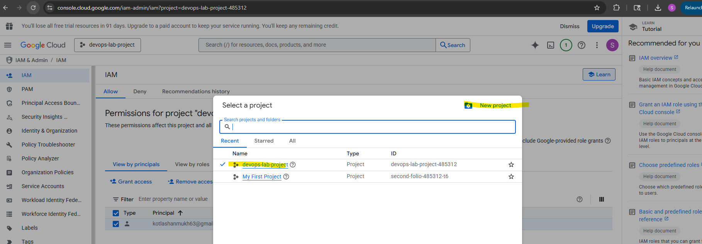
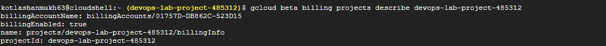
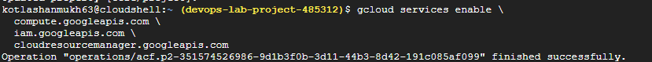
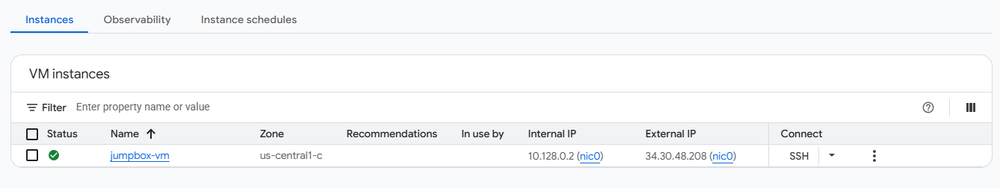

# GCP DevOps / SRE End-to-End Lab

## Overview
This project demonstrates an end-to-end DevOps / SRE lab built on **Google Cloud Platform (GCP)**.  
The goal is to design a realistic, production-style workflow covering cloud setup, CI/CD, infrastructure automation, and Kubernetes deployments.

The lab is designed to be **simple, reproducible, and interview-friendly**, while following real-world best practices.

---

## Objectives
- Create a GCP project with billing and required APIs enabled
- Use a **bootstrap (jumpbox) VM** for tooling and CI/CD
- Manage infrastructure using **Terraform**
- Build CI/CD pipelines using **Jenkins**
- Deploy applications to **Google Kubernetes Engine (GKE)** using **Helm**
- Manage secrets securely using **GCP Secret Manager** (or Vault – optional)

---

## Architecture Overview
- **GCP Project** (billing enabled)
- **Jumpbox VM (Compute Engine)**
  - Jenkins
  - Terraform
  - kubectl
  - Helm
- **Artifact Registry** for container images
- **GKE Cluster** for application workloads
- **GitHub** for source control and documentation

## GCP Project Creation

A dedicated GCP project was created to isolate all lab resources and follow best practices.

- Project ID: `devops-lab-project-485312`
- Billing: Enabled
- Purpose: application end to end lab

### Project Created in GCP Console

## Billing Enabled

_Billing successfully enabled for the GCP project._

## API's Enabled

_API successfully enabled for the GCP project._

## Jumpbox VM Created

